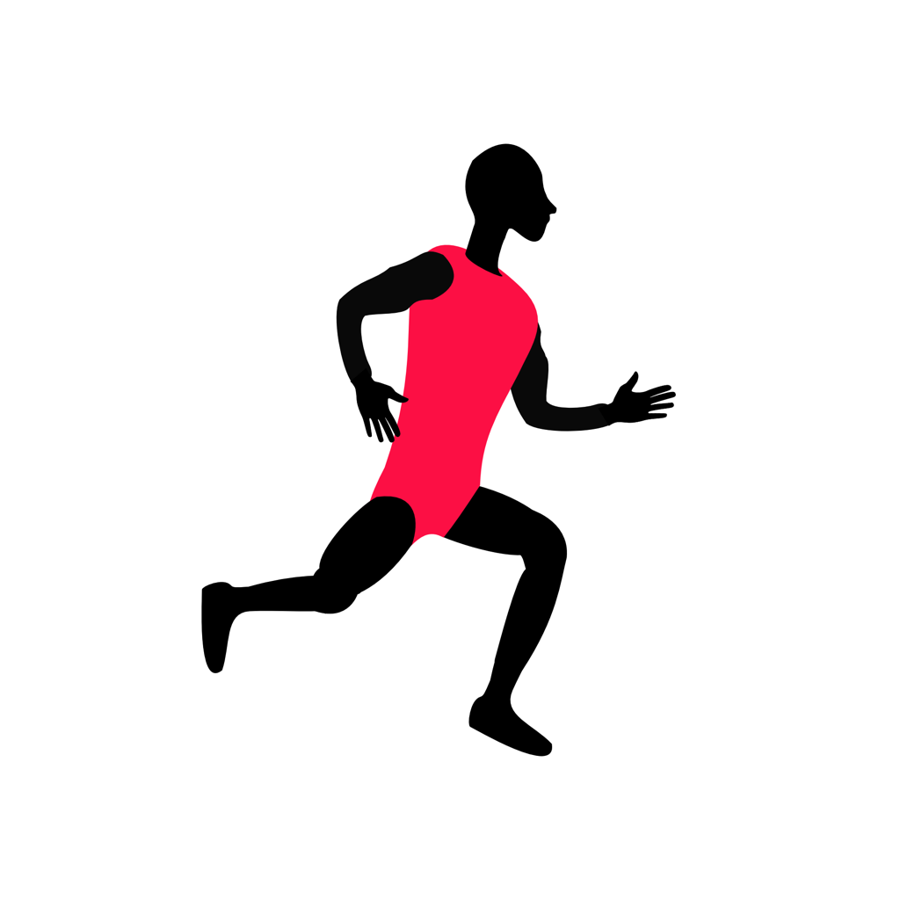
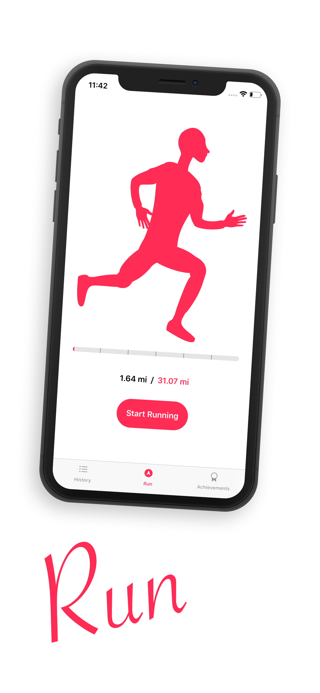
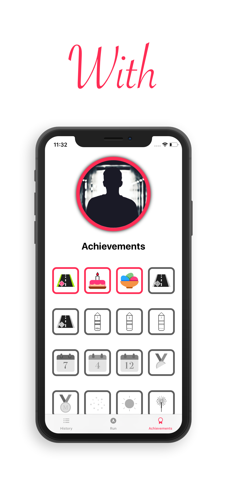
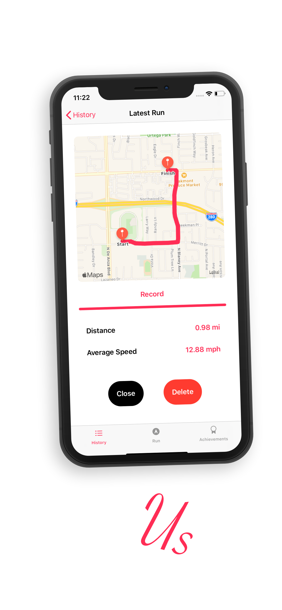

# Essential Runner

With the Essential Runner iOS application you can track your runs, motivate yourself and achieve heights that has never been achieved before. 
You can take it to the next level, and show the world how much potential is in you.

## Screenshots

